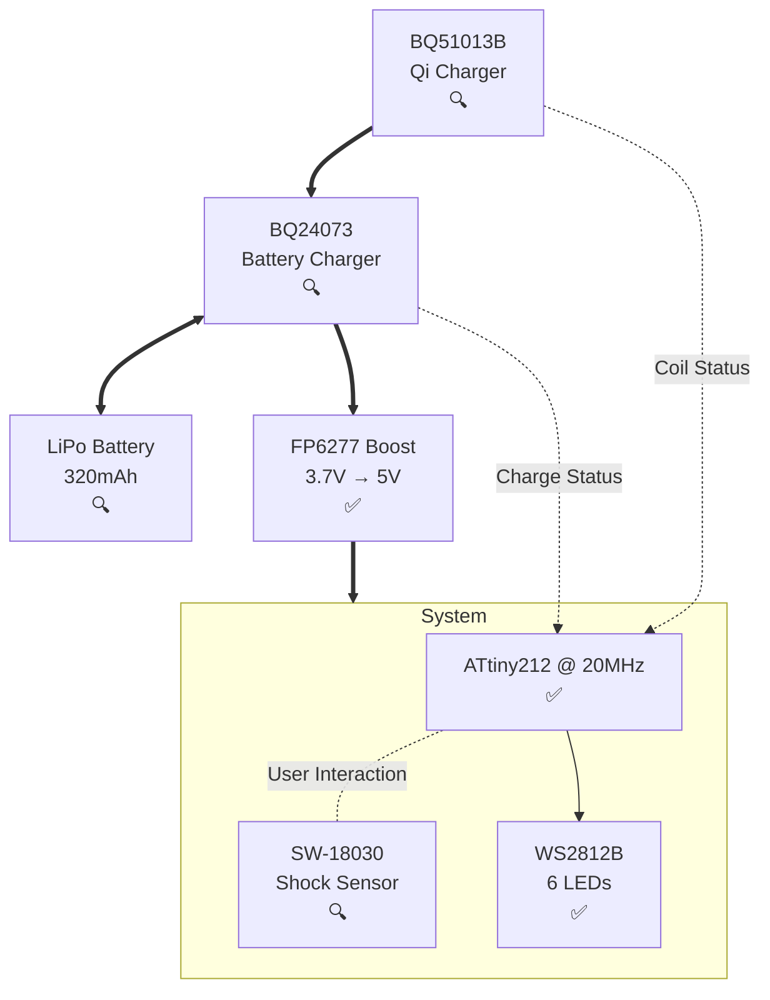

# 🔥 Ignis Project Status

**Last Updated** : September 8, 2025  
**Current Phase** : Hardware Validation ✅ - Firmware Development Phase

## ✅ Completed

### 📚 Project Foundation

- [x] **Workplace Setup**: VS Code, PlatformIO, KiCAD, FreeCAD, Copilot
- [x] **Technical Documentation**: Component datasheets, electrical calculations
- [x] **Mechanical Design**: 3D models, test fixtures, printable STL files
- [x] **Branding Complete**: TheoToys logo system and project identity

### 🔢 Calculations and Design

- [x] **Component Selection**: MCU, LEDs, Qi charger, battery charger, boost converter
- [x] **Electronics Calculations**: Dimensioning of passive components
- [x] **BQ51013B**: Inductive charge
- [x] **BQ24073**: LiPo battery charger with power-path management
- [x] **FP6277**: 3.7V to 5V boost converter
- [x] **SW-18030**: Shock sensor with RC filtering and Schmitt trigger

### 🎨 Artwork and 3D Models

- [x] **3D Modeling**: Enclosure design and prototyping
- [x] **3D Printing Calibration**: Tests and calibration to characterize the PLA filament, determine repetition pattern
- [x] **Missing Components**: Modelled SW18030, battery pack, coil

### 🔌 Hardware

- [x] **IgnisV1**: _Scrubbed_, only schematics, planned to use TP4056 and DMP1045U for battery charging
- [x] **New Battery Management**: Migration TP4056 ⇨ MCP73871 ⇨ BQ24073
- [x] **IgnisV2 Schematics**: Integration of all the components, passives, test points, etc.
- [x] **IgnisV2 PCB Design**: Finalized PCB layout manufacturable by JLCPCB
- [x] **Sourcing**: Sourced all components from LCSC catalog for JLCPCB PCBA
- [x] **Fixes**: Correction of too small vias (IgnisV2.1) and bad WS2812B footprint (IgnisV2.2)

### 🏭 Manufacturing

- [x] **PCB Production**: JLCPCB fabrication
- [x] **PCB Assembly**: JLCPCB assembly service

### 📋 Validation

- [x] **3D Printing tests**: 3D printed some lamp shell without electronics inside for a side project, validated that the design is printable and nice
- [x] **MCU Programming** : ATtiny212 UPDI programming functional with pymcuprog
- [x] **First Light Achievement** : 6x WS2812B LEDs working (380mA max consumption)
- [x] **Power System Validated** : Boost converter (3.7V→5V) working correctly

### 💾 Firmware

- [x] **Hardware Abstraction** : Clean board.h with proper IgnisV2.2 pin mappings
- [x] **Programming Toolchain** : UPDI via pymcuprog working on real hardware
- [x] **Board Testing Framework** : Validation firmware for hardware testing

## 🚧 Next Milestones

### 📋 Validation

- [ ] **Wireless charging system** : Test BQ51013B + IWAS3010 coil integration
- [ ] **Battery integration** : LiPo connection and charge management
- [ ] **Shock sensor integration** : SW-18030 with wake-up interrupts
- [ ] **Indicators**: Inductor, charge, charge complete signals over pull-ups

### 💾 Firmware

- [ ] **Indicators** : Wake on IND_B, CHRG_B, PGOOD_B pins and light pattern for status
- [ ] **User interaction** : Shake-to-wake and charging dock detection
- [ ] **Power management** : Sleep modes and battery monitoring
- [ ] **Flame effect patterns** : Realistic LED and fun animations for flame simulation

### 🎨 Artwork and 3D Models

- [ ] **PCB Support**: Integrate mounting of PCB, coil and battery in the enclosure

### 🏭 Manufacturing

- [ ] **Production**: Print enclosure and mount PCB, coil and battery inside

## 📋 Technical Architecture (IgnisV2.2)

### 🔧 Key Specifications

- **MCU** : ATtiny212-SSN (UPDI programming working)
- **LEDs** : 6x WS2812B-2020 (validated, 380mA max consumption)
- **Power** : FP6277 boost 3.7V→5V (working with external supply)
- **Charging** : BQ24073 + BQ51013B Qi wireless charging (untested)
- **Battery** : EEMB LP402535 (320mAh, not yet integrated)
- **Sensor** : SW-18030 shock detector (not yet integrated)

## 🔧 Current Development Setup

- **MCU** : ATtiny212 @ 20MHz, Arduino framework
- **Programming** : UPDI via pymcuprog (working on real hardware)
- **LEDs** : 6x WS2812B controlled via tinyNeoPixel library
- **Testing** : Board validation firmware with color cycling patterns
- **Power** : External 3.7V supply for boost converter testing
