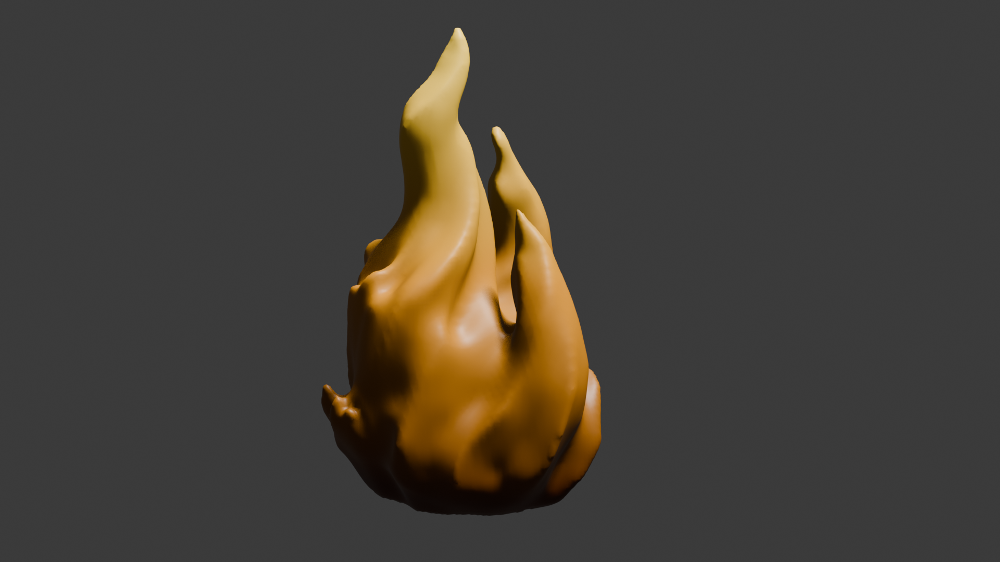
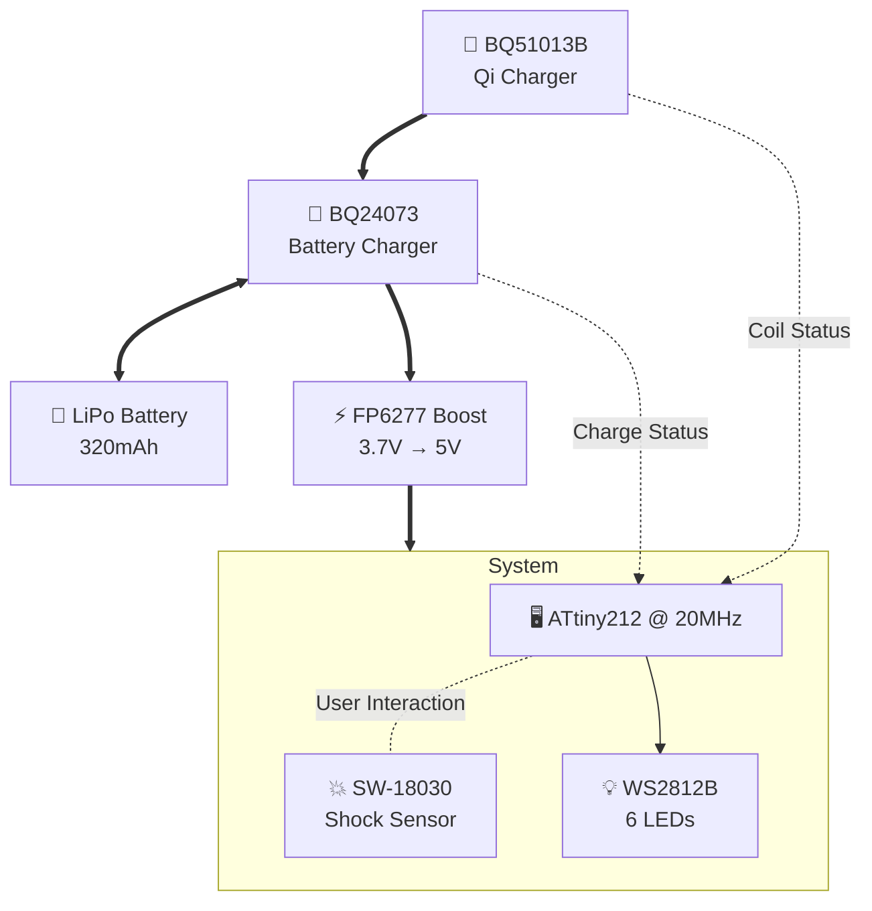

# 🔥 Ignis Project - Ignis Lamp

An autonomous flame-shaped lamp/nightlight controlled by microcontroller with
WS2812B LED ring and **integrated Qi wireless charging**.

  

**Status** : Hardware validated ✅ - Firmware development in progress  
**Last update** : September 2025

## 🎯 Objectives

- **Autonomy** : 2-3 hours on LiPo battery (320 mAh)
- **LED Patterns** : Heartbeat, chase, fade, realistic flame effects
- **Control** : SW-18030 shock detector for interaction
- **Charging** : **Qi wireless** + automatic power-path management
- **Waterproof** : No USB port, induction charging only

## ⚡ IgnisV2 Electrical Architecture

## 📚 Documentation

This repository contains comprehensive documentation for all aspects of the
Ignis project. Navigate to the relevant sections based on your interests:

### 🎯 Project Management

- [📊 PROJECT_STATUS.md](PROJECT_STATUS.md) - Current project status,
  milestones, and development progress

### 💾 Firmware Development

- [🔧 firmware/README.md](firmware/README.md) - ATtiny212 firmware
  documentation, build instructions, and current implementation

### 🔌 Hardware Design

- [⚡ docs/calculations/electrical_design.md](docs/calculations/electrical_design.md) -
  Complete electrical calculations, component sizing, and power analysis
- [🔗 docs/references/schematics_references.md](docs/references/schematics_references.md) -
  Reference schematics and design patterns
- [📋 docs/datasheets/README.md](docs/datasheets/README.md) - Component
  datasheets and technical specifications

### 🎨 Mechanical Design

- [🖼️ mechanical/art/README.md](mechanical/art/README.md) - 3D artwork and
  Blender models (Flamme4 design)
- [🏗️ mechanical/cad/README.md](mechanical/cad/README.md) - CAD models,
  assemblies, and engineering drawings
- [🖨️ mechanical/stl/README.md](mechanical/stl/README.md) - 3D printable files
  and printing guidelines
- [📏 docs/calculations/filament.md](docs/calculations/filament.md) - 3D
  printing material calculations and optimization

---

**For Contributors**: Start with [PROJECT_STATUS.md](PROJECT_STATUS.md) to
understand current progress, then refer to the relevant documentation sections
above based on your area of contribution.
