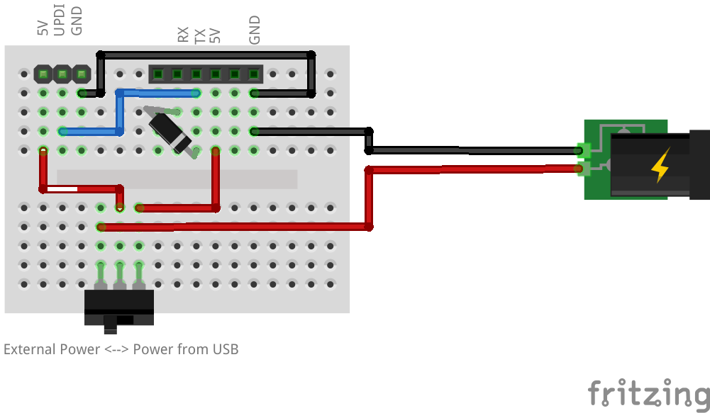

# UPDI Programmer

A simple UPDI programmer for ATtiny and ATmega microcontrollers using a
USB-to-TTL adapter.

<p align="center">
  
</p>

## Overview

This project describes a minimalist UPDI (Unified Program and Debug Interface)
programmer designed for programming Microchip ATtiny and ATmega chips. UPDI is a
simple programming protocol that enables half-duplex communication on a single
wire to the bootloader, allowing reflashing of the device without requiring
complex programming hardware.

## What is UPDI?

UPDI (Unified Program and Debug Interface) is a Microchip-proprietary interface
for external programming and on-chip debugging. It is a successor to the PDI
interface and provides a single-wire, bidirectional half-duplex asynchronous
communication interface. UPDI requires only:

- **Single data wire (UPDI)** for bidirectional half-duplex communication
- **Ground connection (GND)**
- **Power supply (VCC)** - typically 5V for programming
- **Optional RESET line** for high-voltage activation on some devices

This single-wire interface makes it ideal for compact designs and simplified
programming setups compared to traditional 4-wire ISP/ICSP interfaces.

## Hardware Implementation

The implementation is remarkably simple, requiring only:

- A **USB-to-TTL adapter** (such as FTDI FT232RL or similar)
- A **single rectifier diode** between the RX and TX pins
- **Dupont connectors** for easy interfacing
- 2x wires and banana plugs for power connections
- A switch
- A protoboard (e.g., EPLZON)

### Circuit Design

The circuit uses a Schottky diode to combine the TX and RX signals from the UART
interface into a single bidirectional UPDI data line. The diode is connected
with its cathode to TX and its anode to RX, allowing this elegant solution to
enable standard UART hardware to communicate with the half-duplex UPDI protocol
at speeds up to 460800 baud (TURBO mode).

**Key Components:**

- 6-pin male Dupont connector for USB-TTL adapter (FTDI or compatible)
- 3-pin female Dupont connector for target device
- Schottky diode (e.g., CDBM1100-G or BAT85) for TX/RX signal combining
- Power source selection switch (USB-TTL or external power)

**Circuit Schematic:**

```
USB-TTL Adapter          Programmer Circuit          Target Device
                                                      __________________
    TX -------|<|-------,-------------------------- | UPDI
             diode      |                   .------ | GND
    RX -----------------'                   |       | VCC
    VCC --------------------------------------------|__________________
    GND -----------------------------------'
```

### Pinout

**6-Pin Male Connector (USB-TTL Side):** Standard FTDI TTL-232R cable pinout:

- Pin 1: GND (Black wire)
- Pin 2: CTS (Brown wire) - Not used
- Pin 3: VCC/5V (Red wire)
- Pin 4: TX (Orange wire)
- Pin 5: RX (Yellow wire)
- Pin 6: RTS (Green wire) - Not used

**3-Pin Female Connector (Target Device):**

1. **GND** - Ground
2. **Data** - UPDI signal line
3. **VCC** - Power supply (5V)

## Assembly

### Breadboard Prototype

The included Fritzing file (`Flasher.fzz`) provides a breadboard view showing
how components are wired. It is equivalent to how it should be assembled on a
protoboard.

<p align="center">
  
</p>

## Enclosure

A 3D-printed enclosure is available in
[`/mechanical/cad/UPDIFlasherBox/`](../../mechanical/cad/UPDIFlasherBox/).

<p align="center">
  
</p>

**Features:**

- Custom-fitted for populated EPLZON protoboard
- Screw holes (M2) and slots for threaded inserts (M2xD3xL3)
- Connector access holes (6-pin and 3-pin)
- Switch cutout for power selection
- Side hole for external power cables
- Embossed markings showing:
  - GND pin position on both connectors
  - Power switch icons (USB/External)

**Files:**

- [`UPDIFlasherBox.FCStd`](../../mechanical/cad/UPDIFlasherBox/UPDIFlasherBox.FCStd) - FreeCAD source file
- [`UPDIFlasherBox-Top.stl`](../../mechanical/cad/UPDIFlasherBox/UPDIFlasherBox-Top.stl) - Top cover (ready to print)
- [`UPDIFlasherBox-Bottom.stl`](../../mechanical/cad/UPDIFlasherBox/UPDIFlasherBox-Bottom.stl) - Bottom base (ready to print)


## Additional Resources

### Official Documentation

- [Microchip UPDI Specification](https://onlinedocs.microchip.com/oxy/GUID-19DFE3E8-6314-4CFE-BA69-1357E28C8092-en-US-1/GUID-A2FD739F-A1D8-4C2F-9482-0B8AF9DCF435.html) -
  Official Microchip UPDI interface documentation
- [pymcuprog Tool](https://github.com/microchip-pic-avr-tools/pymcuprog) -
  Microchip's Python programming utility
- [megaTinyCore Library](https://github.com/SpenceKonde/megaTinyCore) - Arduino
  core for modern AVR chips
- [UPDI Protocol Overview](https://github.com/SpenceKonde/AVR-Guidance/blob/master/UPDI/UpdiProgramming.md) -
  Community documentation
- [Teddy Warner's SerialUPDI Guide](https://teddywarner.org/Projects/SerialUPDI/) -
  Excellent detailed tutorial
- [FTDI TTL-232R Cable Datasheet](https://ftdichip.com/wp-content/uploads/2023/07/DS_TTL-232R_CABLES.pdf) -
  Official cable pinout reference
- [EPLZON Protoboards](https://www.amazon.fr/EPLZON-prototypage-Breadboard-électronique-compatibles/dp/B0B4DFTTDR) -
  Recommended protoboard for assembly

## License

MIT License

Copyright (c) 2025 Ignis Project

Permission is hereby granted, free of charge, to any person obtaining a copy of
this software and associated documentation files (the "Software"), to deal in
the Software without restriction, including without limitation the rights to
use, copy, modify, merge, publish, distribute, sublicense, and/or sell copies of
the Software, and to permit persons to whom the Software is furnished to do so,
subject to the following conditions:

The above copyright notice and this permission notice shall be included in all
copies or substantial portions of the Software.

THE SOFTWARE IS PROVIDED "AS IS", WITHOUT WARRANTY OF ANY KIND, EXPRESS OR
IMPLIED, INCLUDING BUT NOT LIMITED TO THE WARRANTIES OF MERCHANTABILITY, FITNESS
FOR A PARTICULAR PURPOSE AND NONINFRINGEMENT. IN NO EVENT SHALL THE AUTHORS OR
COPYRIGHT HOLDERS BE LIABLE FOR ANY CLAIM, DAMAGES OR OTHER LIABILITY, WHETHER
IN AN ACTION OF CONTRACT, TORT OR OTHERWISE, ARISING FROM, OUT OF OR IN
CONNECTION WITH THE SOFTWARE OR THE USE OR OTHER DEALINGS IN THE SOFTWARE.
