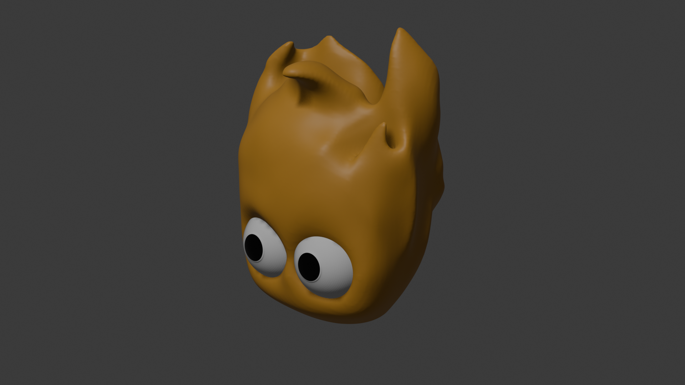

# 🖼️ Art & Design - Projet Ignis

Ce dossier regroupe les modèles artistiques 3D pour la lampe "Flamme dans le
sable".

## 📚 Contexte

Ce projet vise à concevoir une veilleuse autonome en forme de flamme, pilotée
par microcontrôleur et LEDs adressables. Pour plus d'informations sur
l'architecture, l'électronique et le firmware, consultez les README principaux :

- [README général](../../README.md)
- [README firmware](../../firmware/README.md)
- [README datasheets](../../docs/datasheets/README.md)

## 🎨 Versions de Design

### Flamme1

- **Description** : Design simple, représentant uniquement la flamme.
- **Statut** : Premier essai, rendu jugé satisfaisant et naturel.
- **Fichiers** :
  - `Flamme1.blend` (modèle Blender)
  - `Flamme1.stl` (export impression 3D)
  - `Flamme1.png` (screenshot)
- 

### Flamme2

- **Description** : Variante du design Flamme1, avec un "visage" retravaillé et
  ajout d'yeux.
- **Statut** : Résultat mitigé, le rendu du visage reste perfectible.
- **Fichiers** :
  - `Flamme2.blend` (modèle Blender)
  - `Flamme2.stl` (export impression 3D)
  - `Flamme2.png` (screenshot)
- 

## 🏆 Choix du Design

À ce stade, Flamme1 est privilégié pour la suite du projet, sauf si un troisième
design est entièrement repensé.

---

**Pour toute information technique ou contexte global, reportez-vous aux README
des dossiers racine.**
