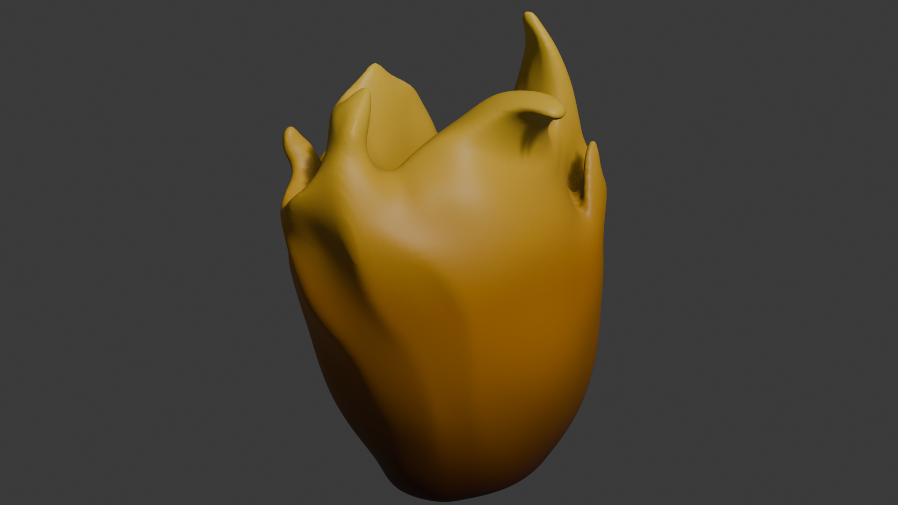
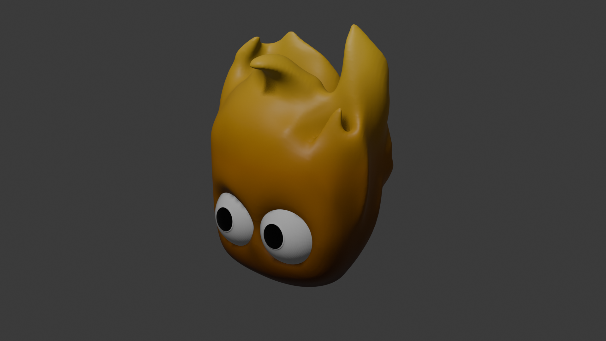
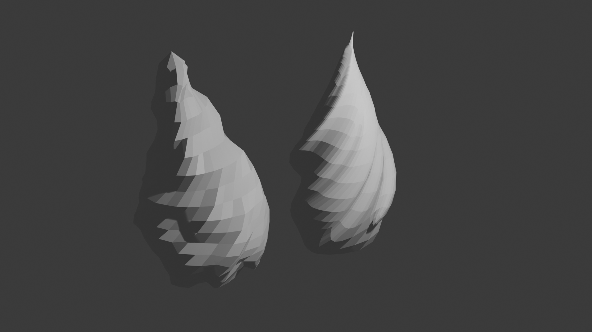
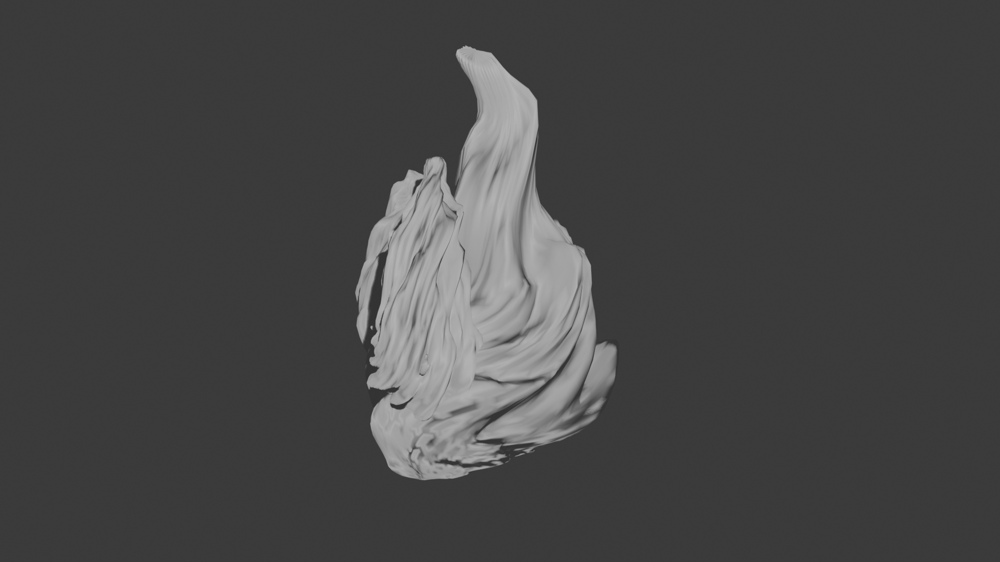
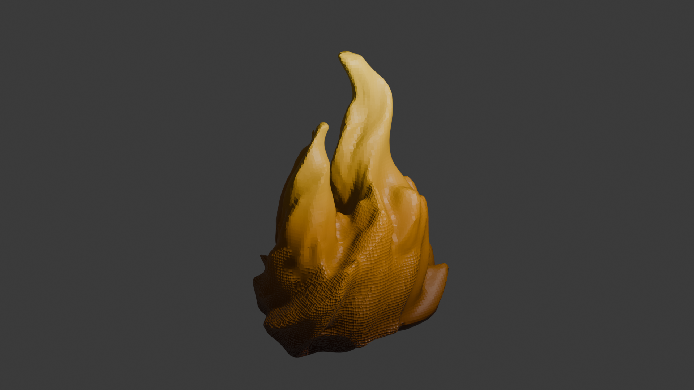

# 🖼️ Art & Design - Lampe Ignis

Ce dossier regroupe les modèles artistiques 3D pour la Lampe Ignis, une lampe en forme de flamme.

## 📚 Contexte

La Lampe Ignis est une veilleuse autonome en forme de flamme, pilotée par microcontrôleur et LEDs adressables. Sa particularité : le socle contient du sable, renfermant un élément mystérieux ou précieux, renforçant l'aspect décoratif et symbolique du projet.
Pour plus d'informations sur l'architecture, l'électronique et le firmware, consultez les README principaux :

- [README général](../../README.md)
- [README firmware](../../firmware/README.md)
- [README datasheets](../../docs/datasheets/README.md)

## 🎨 Versions de Design

### Flamme1

- **Description** : Design simple, représentant uniquement la flamme.
- **Fichiers** :
  - [`Flamme1.blend`](Flamme1/Flamme1.blend) (modèle Blender)
  - [`Flamme1.stl`](Flamme1/Flamme1.stl) (export impression 3D)
  - [`Flamme1_0001.png`](Flamme1/Flamme1_0001.png) (screenshot)

### Flamme2

- **Description** : Variante du design Flamme1, avec un "visage" retravaillé et
  ajout d'yeux.
- **Fichiers** :
  - [`Flamme2.blend`](Flamme2/Flamme2.blend) (modèle Blender)
  - [`Flamme2.stl`](Flamme2/Flamme2.stl) (export impression 3D)
  - [`Flamme2_0000.png`](Flamme2/Flamme2_0000.png) (screenshot)

### Flamme1 - Low Poly

- **Description** : Version simplifiée et stylisée de Flamme1, avec un maillage
  réduit pour un rendu low poly sympa. Les dimensions ont également été
  retravaillées (objet plus petit, 75cm de large, même proportions) et le
  fichier STL a les bonnes dimensions.
- **Fichiers** :
  - [`Flamme1_lowpoly.blend`](Flamme1/Flamme1_lowpoly.blend) (modèle Blender)
  - [`Flamme1_lowpoly.stl`](Flamme1/Flamme1_lowpoly.stl) (export impression 3D)
  - [`Flamme1_lowpoly_0001.png`](Flamme1/Flamme1_lowpoly_0001.png) (screenshot)

### Flamme3_1

- **Description** : Premier essai pour designer une flamme à partir d'un mesh travaillé et des modifiers subdivision surface et deform (twist). **Abandonné**.
- **Fichiers** :
  - [`Flamme3_1.blend`](Flamme3/Flamme3_1.blend) (modèle Blender)
  - [`Flamme3_1_0001.png`](Flamme3/Flamme3_1_0001.png) (screenshot)

### Flamme3_2

- **Description** : Flamme créée à partir de meshs sphériques puis des modifiers Displace, Deform (Twist), Curve et autres. Sert de base aux versions suivantes.
- **Fichiers** :
  - [`Flamme3_2.blend`](Flamme3/Flamme3_2.blend) (modèle Blender)
  - [`Flamme3_2_0001.png`](Flamme3/Flamme3_2_0001.png) (screenshot)

### Flamme3_3

- **Description** : Mesh de Flamme3_2 combiné et sculpté, mais beaucoup de détails perdus pendant la sculpture.
- **Fichiers** :
  - [`Flamme3_3.blend`](Flamme3/Flamme3_3.blend) (modèle Blender)
  - [`Flamme3_3_0001.png`](Flamme3/Flamme3_3_0001.png) (screenshot)

### Flamme3_4 ⭐

- **Description** : Mesh de Flamme3_2 repris à zéro et sculpté plus doucement, résultat prometteur. **C'est le modèle le plus abouti** de la série Flamme3.
- **Fichiers** :
  - [`Flamme3_4.blend`](Flamme3/Flamme3_4.blend) (modèle Blender)
  - [`Flamme3_4.stl`](Flamme3/Flamme3_4.stl) (export impression 3D)
  - [`Flamme3_4_0001.png`](Flamme3/Flamme3_4_0001.png) (screenshot)

