# 🔧 Mechanical CAD - Projet Ignis

This folder contains all the CAD models and mechanical designs for the Ignis
project, created using **FreeCAD**. These models support the hardware
development, PCB visualization, and testing workflow.

## 🧩 SW18030 Shock Sensor

  

Custom 3D model of the SW18030 vibration/shock sensor since it's not available
in standard CAD/footprint databases.

- Not fully detailed model - focused on mechanical envelope and mounting points
- Proper dimensions for mechanical clearance checks

## 🧩 Battery Pack Model

  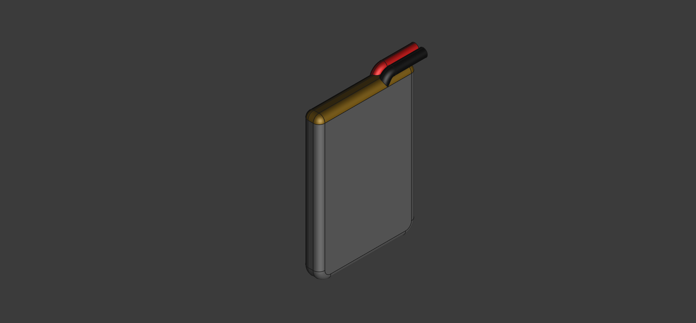

3D representation of the EEMB LP402535 (320mAh) LiPo battery for integration
visualization.

**Specifications**:

- Dimensions: 35×25×4mm (matches datasheet)
- Wire placement and routing visualization
- Proper dimensions for mechanical clearance checks

## 🧩 Qi Receiver Coil Model

  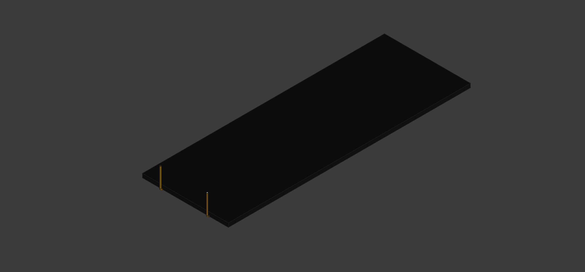

Quick 3D model of the IWAS3010AZEB130KF1 Qi receiver coil for mechanical
integration.

- Dimensions: 30×10×1mm (rectangular coil)
- Wire routing and connection points
- Simplified geometry focused on mechanical envelope - actual coil winding not
  modeled in detail.

## 🧩 TestStand - PCB Test Fixture

  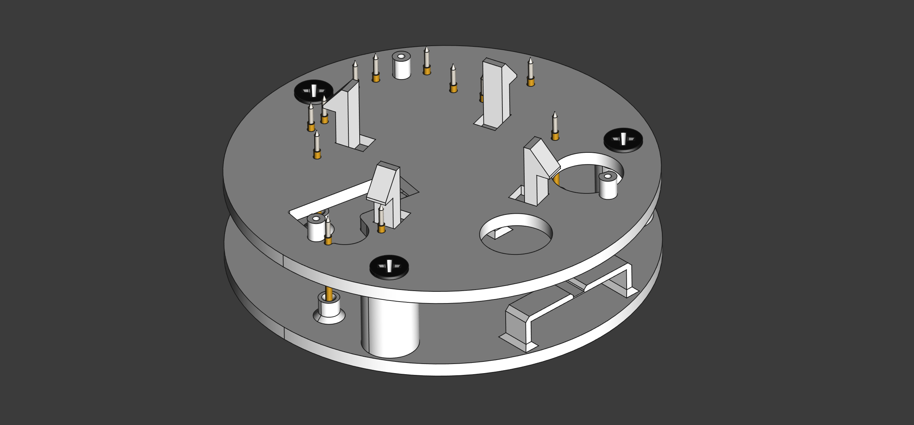

  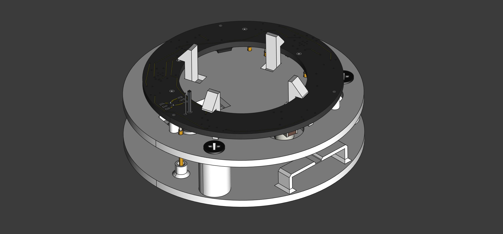

  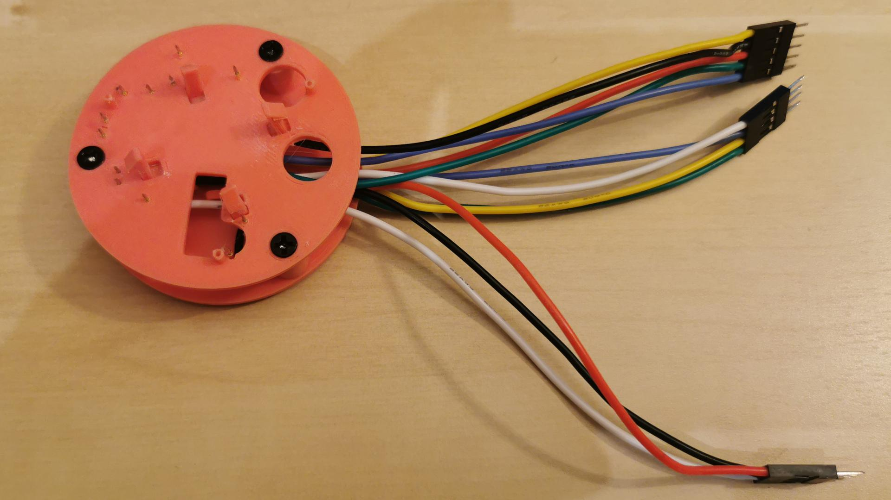

Custom test fixture for IgnisV2.2 PCB programming and validation with pogo pin
connections.

**Files**:

- `TestStand.FCStd` - FreeCAD source file
- `TestStand-Top.stl` - Upper part for 3D printing
- `TestStand-Bottom.stl` - Lower part with pogo pin holders
- `TestStand-Hook.stl` - PCB retention hooks

**Features**:

- Positioned pogo pins to match IgnisV2.2 test pads
- Top and Bottom disks to hold the pogo pins securely
- Hooks hold board under test in position
- Cable management

### ⚠️ Version 1 - Known Issues

1. **Hook attachment**: Difficult to glue hooks on top part - redesign needed
2. **Cable holders**: Too fragile, already broken on printed version
3. **Pogo pins**: Missing pins for drilled pads (pins are too thin)

**Note**: It was expected that the pogo pins would not fit the drilled pads
because it was planned to hook cables. This works great, but finally it is nice
also that the testing stand can access all the pads at the same time. And I
forgot to add specific testing pads for the signals that already had drilled
pads.

**Note**: Next time, I shall pay more attention to the position of the testing
pads with respect to the other components and mounting holes. It is clear from
this test stand that some pads are difficult to reach, specially when a
component needs a clearance in the Top part because it is too tall. Also, I've
read that testing pads are better placed on the rear side of the PCB. I've read
that too late in the design process and now I understand why!

## 🧩 TestStand V2 - PCB Test Fixture

  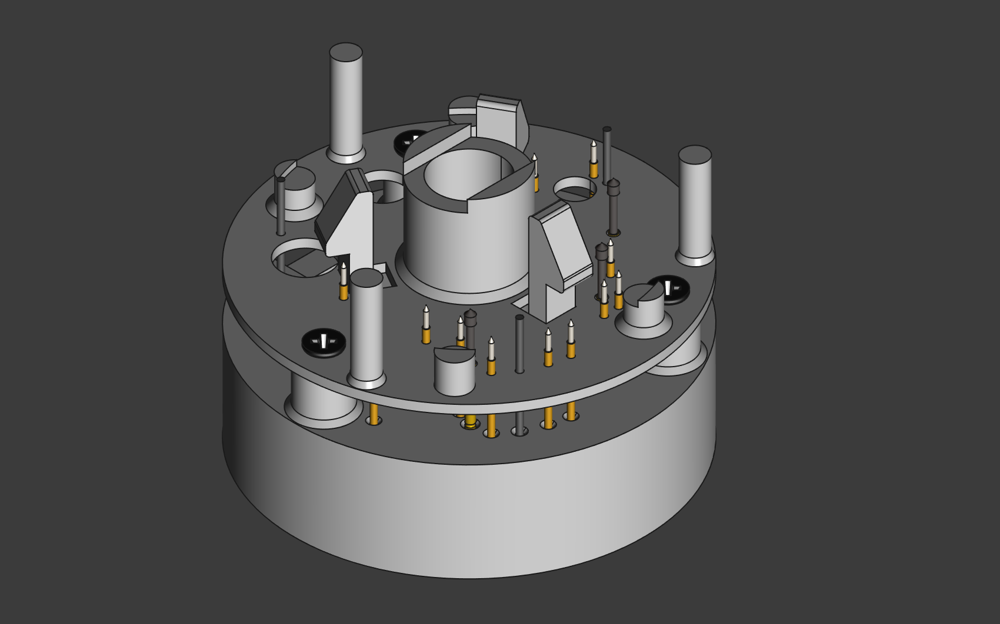

  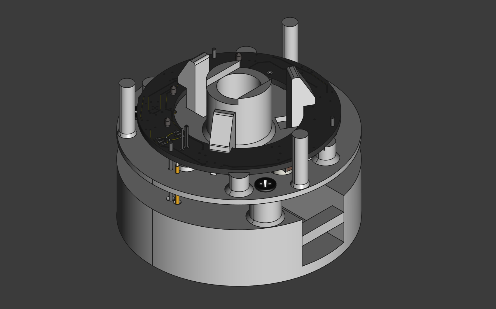

  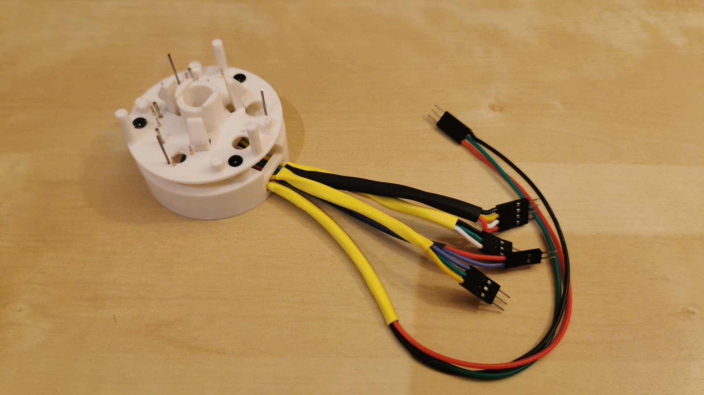

  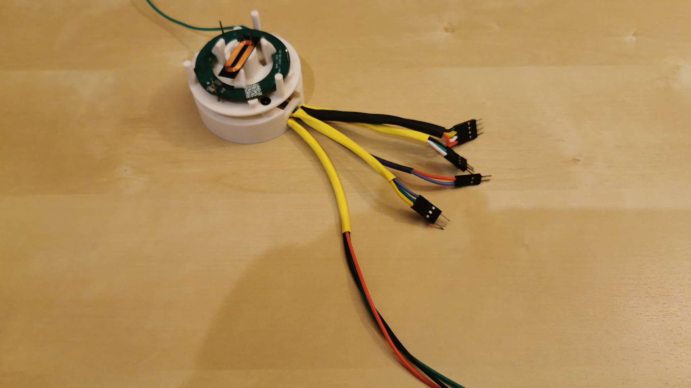

Custom test fixture for IgnisV2.2 PCB programming and validation with pogo pin
connections.!

**Files**:

- `TestStandV2.FCStd` - FreeCAD source file
- `TestStandV2-Guide.stl` - Upper part for 3D printing
- `TestStandV2-Base.stl` - Lower part with pogo pin holders
- `TestStandV2-Hook.stl` - PCB retention hooks
- `TestStandV2.3mf` - 3D model file for 3D printing (OrcaSlicer)
- `IgnisV2TP.csv` - Test pad assignment to connector, position and cable colors

**Features**:

- Positioned pogo pins to match IgnisV2.2 test pads and drilled holes
- Base and Guide disks to hold the pogo pins securely
- Sticks to guide the PCB through its testing holes
- Hooks hold board under test in position
- Cable management

## 🧩 UPDI Flasher Box

  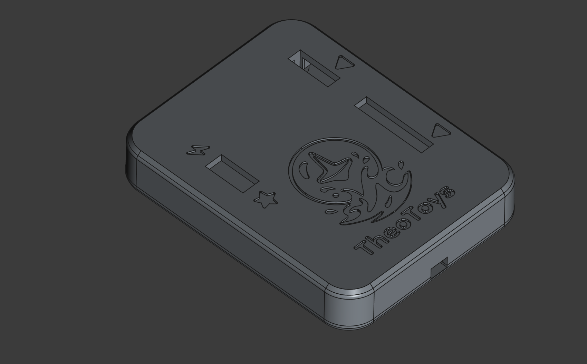

  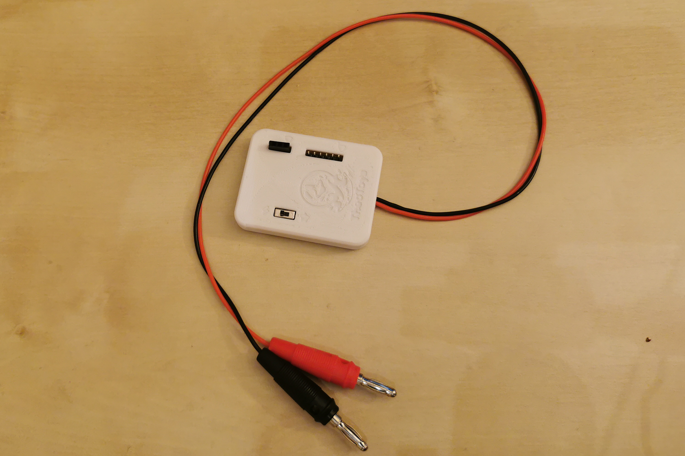

Custom enclosure for the UPDI programmer used to flash the ATtiny212 microcontroller on the Ignis board.

**Files**:

- `UPDIFlasherBox.FCStd` - FreeCAD source file
- `UPDIFlasherBox-Top.stl` - Upper part for 3D printing
- `UPDIFlasherBox-Bottom.stl` - Lower part for 3D printing

**Features**:

- Simple single-wire UPDI protocol implementation using UART (RX/TX)
- Diode-based direction selection for RX/TX communication
- Built on protoboard for easy prototyping and modifications
- Power selection switch between USB power and external PSU
- Two-wire connection for external power supply (standard PSU)
- Compact enclosure protecting the protoboard circuit
- Easy access to programming connections

